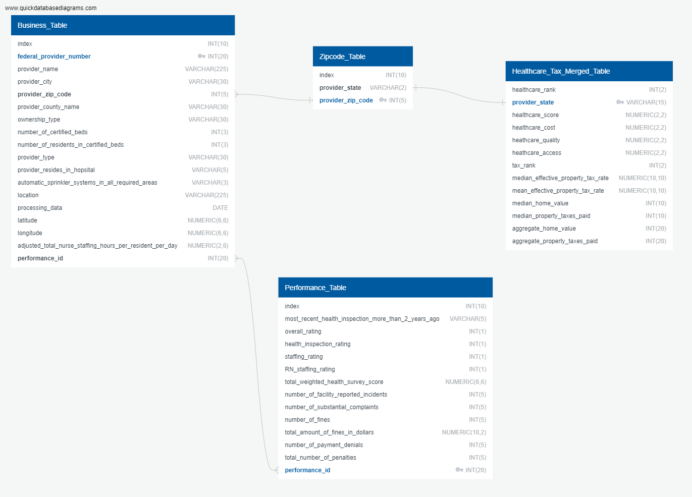
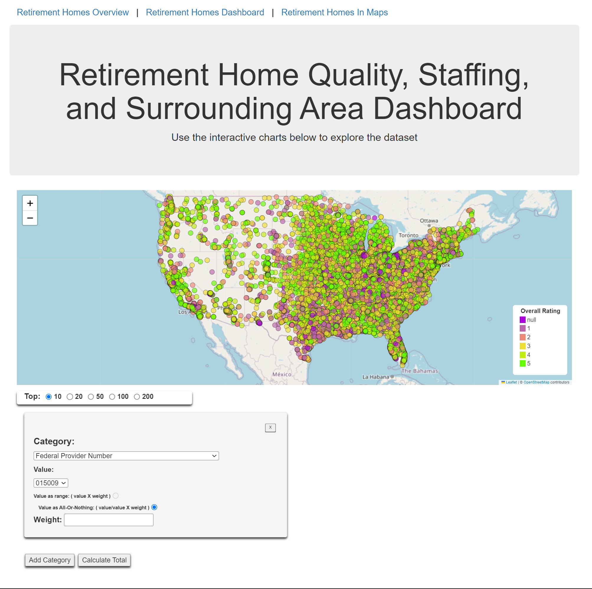
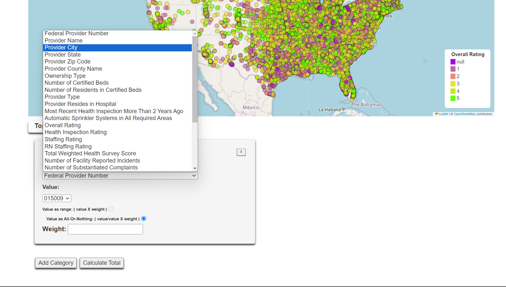
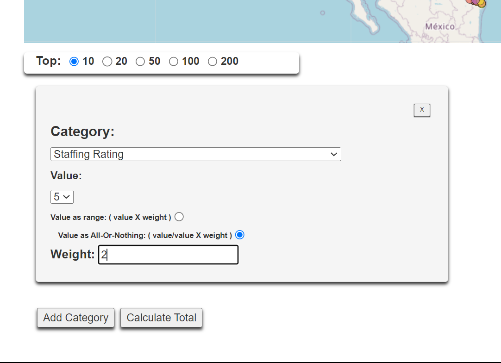
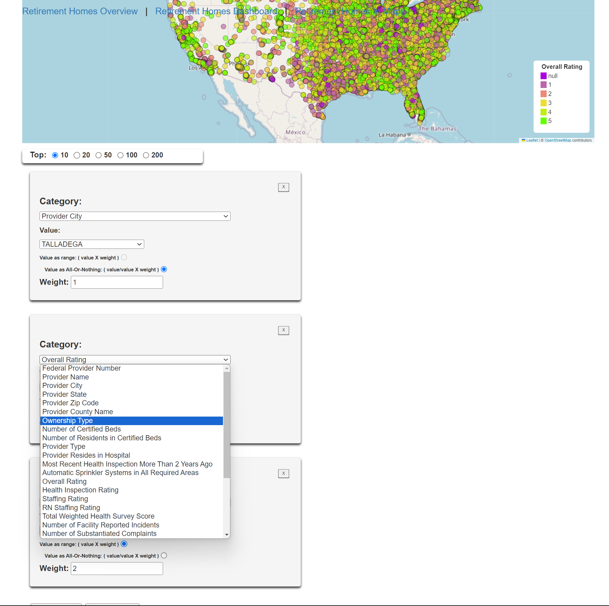
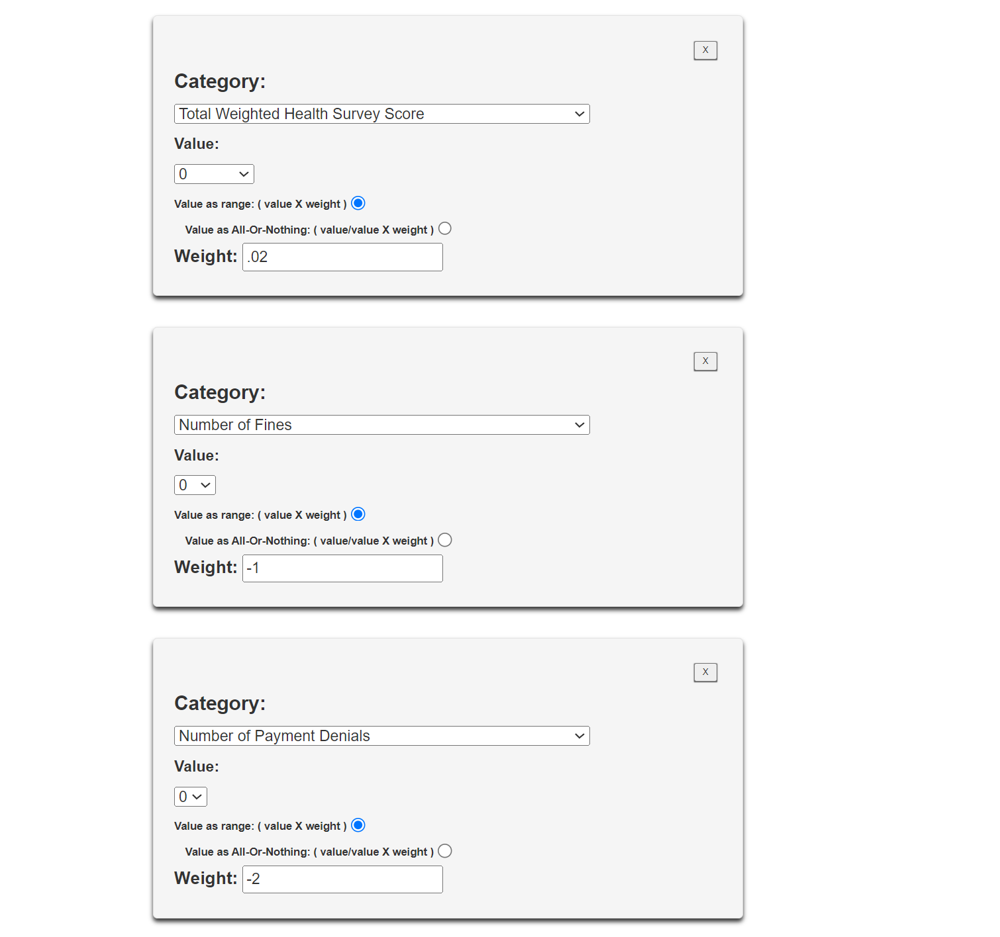
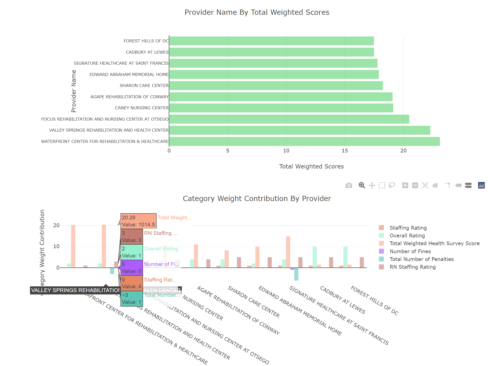

# Project_3_BestRetirement_by_State

## Collaborators: 
Karoly Burgyan 
Thanh Le Dinh 
Shayla Badeaux 
Maria Paula Parra 
Christian Cantu 

---
## Sources 
<ol>
    <li>Nursing Home Quality and Staffing Database. https://www.kaggle.com/datasets/thedevastator/nursing-home-quality-staffing © 2019. This work is openly licensed via CC BY 4.0. </li>
    <li>Property Tax Information by State. https://www.forbes.com/sites/andrewdepietro/2023/09/01/property-taxes-by-state-a-breakdown-of-the-highest-and-lowest-property-taxes-by-state/?sh=6bf5f1b7441b </li>
    <li>Healthcare Rank for Elderly. https://medicareguide.com/best-states-for-elderly-healthcare-340840 </li>
    <li>State Individual Tax Information. https://taxfoundation.org/data/all/state/state-income-tax-rates-2023/ </li>
    <li>Jinja (with Flask). n.d. https://palletsprojects.com/p/jinja/</li>
    <li>Stack Overflow - Where Developers Learn, Share, & Build Careers. (n.d.). Stack Overflow. https://stackoverflow.com/</li>
    <li>Plotly https://plotly.com/javascript/</li>
    <li>Chart.js https://www.chartjs.org/docs/latest/</li>
    <li>Leaftlet https://leafletjs.com/</li>
    <li>GeoJSON https://geojson.io/#map=11.02/29.7666/-95.4065</li>
    <li>ChatGPT https://chat.openai.com/</li>
</ol>

---
## Slide Show Presentation
 <a href="https://docs.google.com/presentation/d/1AyTMH9kfPEsVNtOroBVTMRJSpqwhL2s2nFbILeGHiko/edit#slide=id.p1">Slide Show Link</a>

---
## Project Outline
For Project 3, you will work with your group to tell a story using data visualizations. Here are the specific requirements:
<ul>
<li>
    Your visualization must include a Python Flask-powered API, HTML/CSS, JavaScript, and at least one database (SQL, MongoDB, SQLite, etc.). 
<li>
    Your project should fall into one of the following three tracks:
</li>
 a. A combination of web scraping and Leaflet or Plotly 
 b. A dashboard page with multiple charts that update from the same data 
 c. A server that performs multiple manipulations on data in a database prior to visualization (must be approved) 
<li>
    Your project should include at least one JS library that we did not cover.
</li>
<li>
    Your project must be powered by a dataset with at least 100 records.
</li>
<li>
    Your project must include some level of user-driven interaction (e.g., menus, dropdowns, textboxes).
</li>
<li>
    Your final visualization should ideally include at least three views.
</li>
</ul>
For this project, you can focus your efforts within a specific industry: Finance, Healthcare, Custom. 

## Project Question/Goals
Create a story with three views.  
What are the best places to retire in each state? 
<ul>
<li>
    An overview to see the count of the total number of 5-star rated nursing homes per state. This would be the first step in order to narrow down search parameters to a specific state or list of states.
</li>
<li>
    An interactive map to explore the dataset by using filters for location and overall rating.
</li>
</ul>
What are the best retirement homes for you specifically?
<ul>
<li>
    An interactive dashboard that allows you to fine-tune your search for a more perfect match for retirement with a weighted priority search that takes seconds to personalize to your needs and desires.
    </li>
</ul>

## Javascript Libraries used
<ol>
    <li>
        Chart.js
    </li>
    <li>
        Leaflet.js
    </li>
    <li>
        Plotly.js
    </li>
    <li>
        GeoJSON.js
    </li>
</ol>

## Creating the DataFrames:
We created a jupyter notebook using pandas to load, clean, transform, extract, and export the 'business', 'performance', 'zipcode', and the 'healthcare/tax' DataFrames from the original .xlsx files into new CSV and JSON files. 
  

Next Steps Included:  
1. Inspecting the data via the number of rows/columns, list of all columns present and their associated data types, and investigating any non-values if present.
2. Dropping any duplicate rows, if any. (None were found)
3. Adding Null to any records with non-values.  
4. Separating the Coordinates column into separate Longitude and Latitude columns.  
5. Removing any extraneous columns and leaving only the ones necessary for our analysis.  
6. Creating the three separate DataFrames from the newly cleaned DataFrame.  
7. Exporting the newly created DataFrames into CSV and JSON files for future use.  

## Creating A Database From The New CSV Data Files:

To create a database, the CSV files were examined and an Entity-Relationship Diagram was synthesized which led to a schema. Database tables were constructed in Postgresql and, finally, these tables were populated with the data from the CSV files.
<ol style='list-style-type: upper-roman;'>
    <li>
        <strong>Inspect The .csv Files And Create The Schema And Entity-Relationship Diagram:</strong> 
        Inspecting the .csv files led to the synthesis of the following schema:   
        
           
            Business_Table
            - 
            index INT(10)
            federal_provider_number INT(20) PK 
            provider_name VARCHAR(225)
            provider_city VARCHAR(30)
            provider_zip_code INT(5) FK >- Zipcode_Table.provider_zip_code
            provider_county_name VARCHAR(30)
            ownership_type VARCHAR(30)
            number_of_certified_beds INT(3)
            number_of_residents_in_certified_beds INT(3)
            provider_type VARCHAR(30)
            provider_resides_in_hopsital VARCHAR(5)
            automatic_sprinkler_systems_in_all_required_areas VARCHAR(3)
            location VARCHAR(225)
            processing_data DATE
            latitude NUMERIC(6,6)
            longitude NUMERIC(6,6)
            adjusted_total_nurse_staffing_hours_per_resident_per_day NUMERIC(2,6)
            performance_id INT(20) FK >-< Performance_Table.performance_id

            Performance_Table
            -
            index INT(10)
            most_recent_health_inspection_more_than_2_years_ago VARCHAR(5)
            overall_rating INT(1)
            health_inspection_rating INT(1)
            staffing_rating INT(1)
            RN_staffing_rating INT(1)
            total_weighted_health_survey_score NUMERIC(6,6)
            number_of_facility_reported_incidents INT(5)
            number_of_substantial_complaints INT(5)
            number_of_fines INT(5)
            total_amount_of_fines_in_dollars NUMERIC(10,2)
            number_of_payment_denials INT(5)
            total_number_of_penalties INT(5)
            performance_id INT(20) PK
            
            
            Zipcode_Table
            - 
            index INT(10)
            provider_state VARCHAR(2) FK - Healthcare_Tax_Merged_Table.provider_state
            provider_zip_code INT(5) PK
            
            
            Healthcare_Tax_Merged_Table
            -
            healthcare_rank INT(2)
            provider_state VARCHAR(15) PK
            healthcare_score NUMERIC(2,2)
            healthcare_cost NUMERIC(2,2)
            heathcare_quality NUMERIC(2,2)
            heathcare_access NUMERIC(2,2)
            tax_rank INT(2)
            median_effective_property_tax_rate NUMERIC(10,10)
            mean_effective_property_tax_rate NUMERIC(10,10)
            median_home_value INT(10)
            median_property_taxes_paid INT(10)
            aggregate_home_value INT(20)
            aggregate_property_taxes_paid INT(20)

                               
                                          
 
        Which in turn led to the following ERD built in <a href="https://www.quickdatabasediagrams.com/">QuickDatabaseDiagrams.com</a>:
         
         
         
        
    </li>
     
    <li>
        <strong>Construct Database Tables:</strong> 
        The following postgresql code was run in pgAdmin4:  

        --Create Table Schema
        CREATE TABLE Zipcode_Table(
        	index INT NOT NULL,
        	provider_state VARCHAR(2) NOT NULL,
        	provider_zip_code INT PRIMARY KEY NOT NULL
        );
        
        CREATE TABLE Performance_Table(
        	index INT NOT NULL,
        	most_recent_health_inspection_more_than_2_years_ago VARCHAR(5) NOT NULL,
        	overall_rating INT NOT NULL,
        	health_inspection_rating INT NOT NULL,
        	staffing_rating INT NOT NULL,
        	RN_staffing_rating INT NOT NULL,
        	total_weighted_health_survey_score NUMERIC(6,6) NOT NULL,
        	number_of_facility_reported_incidents INT NOT NULL,
        	number_of_substantial_complaints INT NOT NULL,
        	number_of_fines INT NOT NULL,
        	total_amount_of_fines_in_dollars NUMERIC(10,2) NOT NULL,
        	number_of_payment_denials INT NOT NULL,
        	total_number_of_penalties INT NOT NULL,
        	performance_id INT NOT NULL PRIMARY KEY
        );
                          
        CREATE TABLE Business_Table (
        	index INT NOT NULL,
        	federal_provider_number INT PRIMARY KEY NOT NULL, 
        	provider_name VARCHAR(225) NOT NULL,
        	provider_city VARCHAR(30) NOT NULL,
        	provider_zip_code INT NOT NULL,
        		FOREIGN KEY (provider_zip_code) REFERENCES zipcode_table(provider_zip_code),
        	provider_county_name VARCHAR(30) NOT NULL,
        	ownership_type VARCHAR(30) NOT NULL,
        	number_of_certified_beds INT NOT NULL,
        	number_of_residents_in_certified_beds INT NOT NULL,
        	provider_type VARCHAR(30) NOT NULL,
        	provider_resides_in_hopsital VARCHAR(5) NOT NULL,
        	automatic_sprinkler_systems_in_all_required_areas VARCHAR(3) NOT NULL,
        	location VARCHAR(225) NOT NULL,
        	processing_data DATE NOT NULL,
        	latitude NUMERIC(6,6) NOT NULL,
        	longitude NUMERIC(6,6) NOT NULL,
        	adjusted_total_nurse_staffing_hours_per_resident_per_day NUMERIC(6,6) NOT NULL,
        	performance_id INT NOT NULL,
        		FOREIGN KEY (performance_id) REFERENCES performance_table(performance_id)
        );

        CREATE TABLE Healthcare_Tax_Merged_Table (
        	healthcare_rank INT NOT NULL,
        	provider_state VARCHAR(15) PRIMARY KEY NOT NULL,
        	healthcare_score NUMERIC(2,2) NOT NULL,
        	healthcare_cost NUMERIC(2,2) NOT NULL,
        	healthcare_quality NUMERIC(2,2) NOT NULL,
        	healthcare_access NUMERIC(2,2) NOT NULL,
        	tax_rank INT NOT NULL,
        	median_effective_property_tax_rate NUMERIC (10,10) NOT NULL,
        	mean_effective_property_tax_rate NUMERIC (10,10) NOT NULL,
        	median_home_value INT NOT NULL,
        	median_property_taxes_paid INT NOT NULL,
        	aggergate_home_value INT NOT NULL,
        	aggregate_property_taxes_paid INT NOT NULL
        );
             
    </li>

---
## Main.py:

Flask and Jinja were used to set up the framework for hosting the multiple URL routes. These URL routes helped us to utilize different extracted JSON files
created from our cleaned DataFrames. 

---
## Overview Page:

Our new javascript library, Chart.js, was used to plot two overview charts. The first is a bar graph plotting how many Retirement Homes, that had a 5-star rating, were available in the corresponding state. A hover option was also utilized to pinpoint down to any certain state. 

The second plot is a visual map, using OpenStreetMap,  displaying the same information as above. The hover option presents more specific information about the specific state choses, such as the Provider Percentage and Total Number of Providers. The colors shown, represent highest percentage(red), middle percentage(purple) and lowest percentage(blue) according to Provider Percentage. 

---
## Interactive Maps Page:

This page utilizes the Leaflet javascript library along with OpenStreetMap, in order to create an interactive map plotting all the Retirement Homes available in our database. From here, the user can filter by Overall Rating and State Location. 

---
## Dashboard Page:
The interactive dashboard allows you to set your preferences in a search for the right retirement home to whatever attributes you value in a retirement home from among 29 categories. With this ability, you can answer the question, "Where's a good place to retire for ME with MY priorities?"   
The dashboard is an interactive experience that:
<ul>
    <li>
        allows you to peruse 15,000+ retirement homes across the United States
    </li> 
      
    <li>
        allows for the investigation of retirement homes based upon any number of the following 29 categories: 
        <ul>
            <li>
                'Staffing Rating', 'Health Inspection Rating', 'RN Staffing Rating',  'Provider Type',
                'Provider City', 'Number of Substantiated Complaints', 'Provider State',  'Number of Certified Beds', 'Number of Residents in Certified Beds', 
                'Provider Resides in Hospital', 'Provider Name', 'Federal Provider Number',
                'Most Recent Health Inspection More Than 2 Years Ago', 
                'Automatic Sprinkler Systems in All Required Areas', 'Overall Rating',
                'Total Weighted Health Survey Score', 'Number of Facility Reported Incidents',
                'Number of Fines', 'Provider Zip Code', 'Provider County Name',
                'Ownership Type',
                'Total Amount of Fines in Dollars', 'Number of Payment Denials',
                'Total Number of Penalties', 'Location', 'Processing Date', 'Latitude',
                'Adjusted Total Nurse Staffing Hours per Resident per Day', 'Longitude'
            </li>
        </ul>
    </li> 
      
    <li>
        allows you to put a weight on the values of any of the categories in a way that aligns with your priorities. For example:
        <ul>
            <li>
                if you value living in a retirement home that has a 5-star rated staff, you could put a high weight on 'Staffing Rating' equal to '5'
            </li>
            <li>
                if you value living in Oregon, then you could put a high weight value on 'Provider State' equal to Oregon,
            </li>
            <li>
                if you value living in a retirement home that's not in a Hospital, you could put a high weight on 'Provider Resides in Hospital' equal to 'False'
            </li>
        </ul>
    </li> 
      
    <li>
        allows you to stack multiple weighted categories and even multiple values within a category. For example:
        <ul>
            <li>
                if you value living in Miami, with highly rated staff, in a place that accepts medicare, and a high health inspection rating, then you could put high weights on 'Provider City' equal to 'Miami', 'Staffing Rating' equal to '5', 'Provider Type' equal to 'Medicare', 'Provider Type' equal to 'Medicare and Medicaid', and 'Health Inspection Rating' equal to '5'
            </li>
            <li>
                if you desire to live in one of the 4 cities of 'Miami', 'Orlando', 'Denver', or 'St. Augustine', then you could put high weights on 'Provider City' equal to 'Miami', 'Orlando', 'Denver', and 'St. Augustine'
            </li>
        </ul>
    </li> 
      
    <li>
        allows you to put a negative weight on values of a category that corresponds to qualities you want to avoid. For example:
        <ul>
            <li>
                if you want to live in Florida in a retirement home with a 5-star 'Overall Rating' but not in Tampa, Florida, then you could put a high weigh on 'Provider State' equal 'FL' with a weight of '4', 'Overall Rating' equal to '5' with a weight of '4', and 
                'Provider City' equal to 'Tampa' with a weight of '-4'
            </li>
        </ul>
    </li>
    <li>
        allows you to put a weight on a range of values for a given category, which is useful while stacking multiple different categories. For example:
        <ul>
            <li>
                if you value good staff but also value a low number of penalties and a high health inspection rating, then you could set 'Staffing Rating' to 'Value as range' with a weight of '3', set 'Total Number of Penalties' to 'Value as range' with a weight of '-2', and set 'Health Inspection Rating' to 'Value as range' with a weight of '4' 
            </li>
        </ul>
    </li> 
      
    <li>
        allows you to choose between getting the top 10, 20, 50, 100, or 200 retirement homes in accordance with your desired weighting system
    </li>
    <li>
        displays multiple chart views from the retirement data such as:
        <ul>
            <li>
                the weighted totals in a bar chart of the top X number of retirement homes
            </li>
            <li>
                the weighted total by category for each retirement home in a group bar chart
            </li> 
              
            <li>
                the weighted total by category alone which shows how much the weight affects the ranking of all of the retirement homes in a doughnut chart
            </li>
            <li>
                the correlations between the various categories chosen for the weighting that have a numerical value associated with them
            </li> 
              
        </ul>
    </li>
</ul>
So, the dashboard, with its 29 categories, can cater to all sorts of varying opinions on value. It allows you to get the top 10, 20, 50 (etc.) options that speak to the specifics of your life's priorities.  

---
## Conclusion

All three interactive visualization pages will allow the user to help narrow down their search in Retirement Homes based on numerous criteria pertaining to their individual needs and wants. The overview and the interactive maps give a bird's eye view of all the states by the overall rating of the retirement homes there to answer the question,  "What are the best places to retire in each state in general?", for someone who doesn't have time to look into the details. And, on the other hand, the interactive dashboard fine-tunes the search to the particulars of the individual's tastes and answers the question, "What are the best retirement homes for ME specifically?"

        
                
